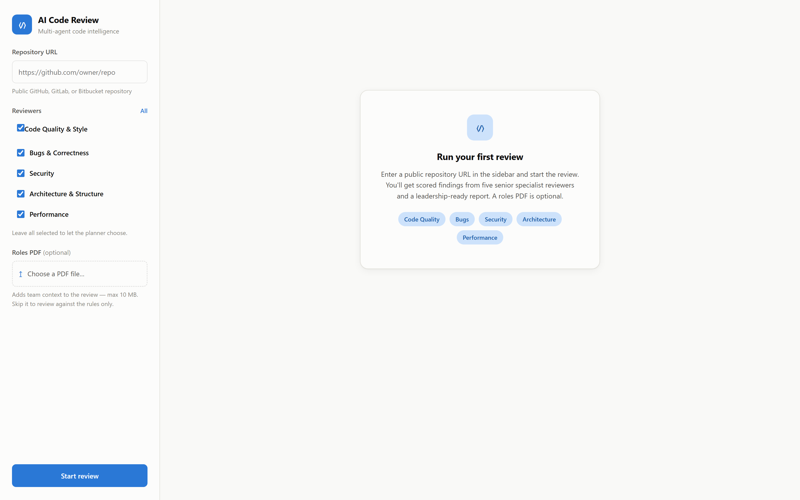

<div align="center">

# AI Code Review Dashboard

**Multi-agent AI code review for any public repository — scored, structured, and exportable as a professional PDF.**

<br>


<br>



</div>

---

## Overview

A professional **FastAPI + vanilla JS** web app that runs a **multi-agent AI code review** on any public GitHub / GitLab / Bitbucket repository. It clones the repo, indexes it for retrieval (RAG), runs five senior-level specialist reviewers in parallel, and produces a scored, structured report you can read in the browser or **download as a professional PDF**.

---

## Features

- **Multi-agent review** — five specialist reviewers, each written as a senior engineer with its own methodology, standards, and severity calibration:

  | Reviewer | Focus |
  | :--- | :--- |
  | **Code Quality & Style** | Dead code, naming, duplication, unprofessional patterns |
  | **Bugs & Correctness** | Logic errors, unhandled failures, leaks, edge cases |
  | **Security** | Injection, XSS, secrets, auth flaws, SSRF, insecure deserialization |
  | **Architecture & Structure** | Coupling, layering, dependency direction, testability |
  | **Performance** | N+1 queries, blocking hot paths, unbounded memory, waste |

- **Real RAG** — the repo is chunked, embedded locally (fastembed), and indexed in FAISS; each reviewer retrieves the code most relevant to its area.
- **Structured results** — an overall score, per-category scores, a severity summary, and per-file findings (severity · file:line · issue · fix).
- **Downloadable report** — a clean, print-ready report document (save as PDF).
- **Optional roles PDF** — upload a team-roles PDF to add context, or skip it and review against the rules only.
- **Choose your reviewers** — run all five or a subset.
- **Pluggable LLM provider** — OpenAI, OpenRouter, or the Anthropic (Claude) API, switchable with one env variable.

---

## Tech Stack

| Layer | Technology |
| :--- | :--- |
| Backend | FastAPI, Pydantic (typed settings + response models) |
| Agents | [`agno`](https://github.com/agno-agi/agno) over OpenAI / OpenRouter / Anthropic |
| RAG | `fastembed` (local embeddings) + `faiss-cpu` |
| Repo & PDF | `gitpython`, `pypdf` |
| Frontend | HTML, CSS, vanilla JavaScript (Markdown via `marked` + `DOMPurify`) |
| Tests | `pytest` |

---

## Project Structure

```
app/
├── main.py                 # FastAPI app factory
├── core/                   # config (typed settings) + logging
├── api/routes/             # pages, /api/review, /api/reviewers, /health
├── schemas/                # Pydantic request/response models
├── services/               # repo, pdf, chunk, vector, agents, orchestrator
│   └── review_rules.py     # the reviewer rule catalog (single source of truth)
├── utils/                  # robust JSON extraction from LLM output
├── static/                 # css + js
└── templates/              # dashboard HTML
tests/                      # pytest suite
```

---

## Getting Started

**Prerequisites:** Python 3.10+ and an API key for OpenAI, OpenRouter, or Anthropic.

1. **Clone and create a virtual environment**

   ```bash
   git clone https://github.com/Muhammadwaqas1234/code-review.git
   cd code-review
   python -m venv venv
   venv\Scripts\activate          # Windows
   # source venv/bin/activate      # macOS / Linux
   ```

2. **Install dependencies**

   ```bash
   pip install -r requirements.txt
   ```

3. **Configure the LLM provider** — copy `.env.example` to `.env` and fill in a key for the provider you want:

   ```
   LLM_PROVIDER=openai            # openai | openrouter | anthropic
   OPENAI_API_KEY=your_key_here
   ```

   `.env` is gitignored — your keys are never committed.

---

## Run

```bash
uvicorn app.main:app --reload
```

Open <http://127.0.0.1:8000>, enter a public repository URL, optionally choose reviewers or upload a roles PDF, and click **Start review**. When it finishes you can read the results in the browser or click **Download report**.

Interactive API docs are available at <http://127.0.0.1:8000/docs>.

---

## Tests

```bash
pytest
```

---

## Configuration Notes

- Only **public** repositories are supported.
- The default models are set per provider in `app/core/config.py` and can be overridden with `SMART_MODEL` / `FAST_MODEL` in `.env`.
- Reviewers, rules, chunking, and limits are all configurable — adding a new reviewer is a single entry in `app/services/review_rules.py`, and it appears in the UI automatically.

---

## License

MIT License © 2026 Waqas Abid — see [LICENSE](LICENSE).

<div align="center">

<br>

*Built by [Muhammad Waqas](https://github.com/Muhammadwaqas1234) — AI Engineer · Agentic AI · RAG*

</div>
